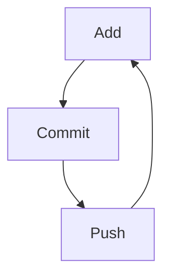

CSPD Git Worshop Notes

**Bold** _italics_ #Title [link](google.com)

'inline code'

"Slow is smooth and smooth is fast."

[up-for-grabs.net]

Find a markdown cheatsheet - google

ACP - Add, Commit, Push - Mantra for workflow

